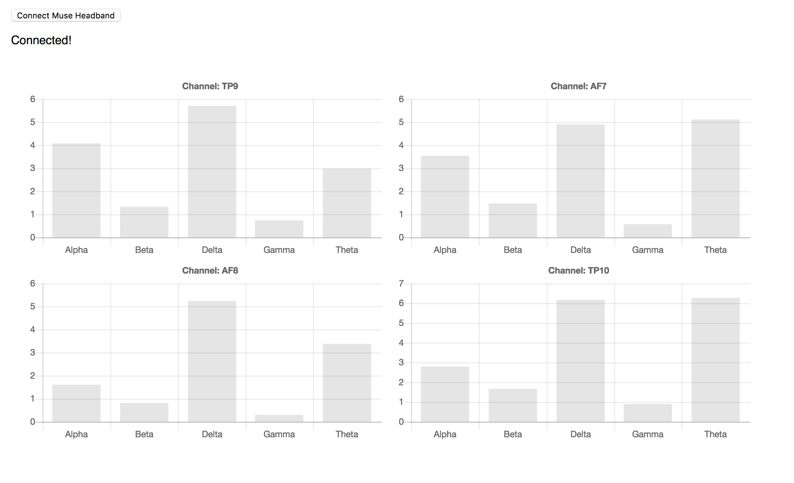

# muse-fft

Explore Muse headband data in frequency domain. Written with Muse.js, EEG-Pipes, React and Charts.js.



# Usage

Install required packaged with:

```npm install```

Then run the application using:

```npm start dev```
