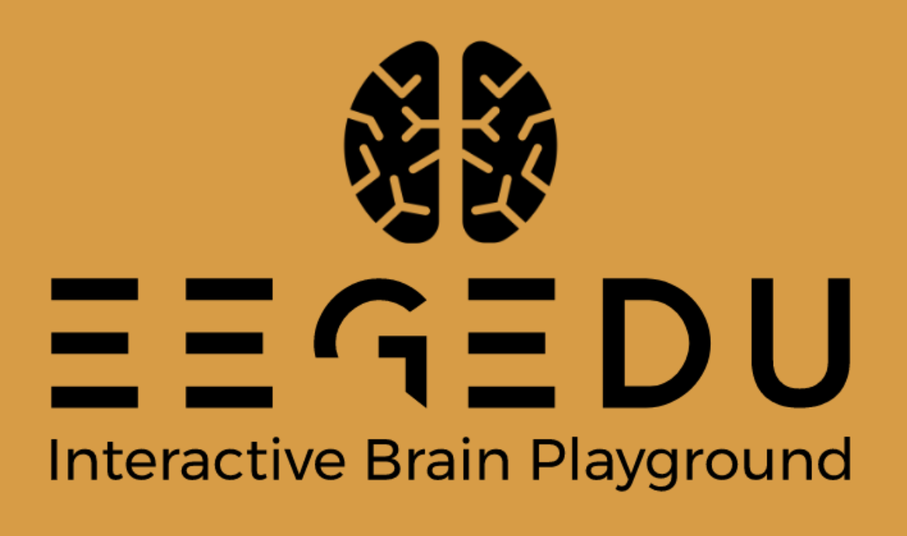

# EEGEdu

<p align="center"> 
<a href="https://github.com/kylemath/EEGEdu/blob/master/LICENSE">

</a>
<a href="https://github.com/kylemath/EEGEdu/blob/master/CONTRIBUTING.md">

</a>


</p>

<p align="center">

</p>

`EEGEdu` is an Interactive Brain Playground. 

`EEGEdu` is served live at [https://eegedu.com/](https://eegedu.com). This website is served from the software in this repository. So, all you need to do to try the system out is head to [EEGEdu](https://eegedu.com/).

`EEGEdu` is designed as an interactive educational website to learn/teach about working with electroencephalogram (EEG) data. It is a teaching tool that allows for students to interact with their own brain waves. 

`EEGEdu` has been inspired by multiple works that came before. It is inspired by [EEG101](https://github.com/NeuroTechX/eeg-101), but `EEGEdu` is web-based. Being web-based allows students to interact with EEG brain data without having to install any software. Others have used [Neurotech EEG-notebooks in python](https://github.com/NeuroTechX/eeg-notebooks) for data collection and analysis with [muse-lsl](https://github.com/alexandrebarachant/muse-lsl).  These software support the Interaxon MUSE headset but require a bluetooth low-energey (BLE) dongle to work with common operating systems (e.g. Windows or Mac OSX). These tools also required the editing `pyglatt` code to connect to Muse headsets. Thus, previous software are cumbersome and serve as a barrier to entry for many students learning about EEG. `EEGEdu` aims to provide students with an accesible introduction to working with their own brain waves.


# EEGEdu Curriculum 

EEGEdu provides an step-by-step incremental tutorial for students to interact with EEG-based brain signals. So, we break down the curriculum into 10 lessons as follows:

1. Connect + hardware, Biophysics + signal viewing
2. Heart rate time domain data
3. Heart rate frequency domain -beats per minute 
4. Raw Data + artifacts + blinks + record
5. Frequency domain explanation + Raw spectra + record
6. Frequency bands + record
7. Spectrogram
8. Neurofeedback p5js demos
9. Eyes closed eyes open experiment
10. SSVEP experiment
11. BCI trainer

# Installation for Development 

If you are interested in developing EEGEdu, here are some instructions to get the software running on your system. *Note*: Currently EEGEdu development requires a Mac OSX operating system. 

To start, you will need to install [Homebrew](https://brew.sh) and [yarn](https://yarnpkg.com/lang/en/docs/install/#mac-stable). These are easy to install with the following Terminal / `bash` commands:

```sh
## Install homebrew
/usr/bin/ruby -e "$(curl -fsSL https://raw.githubusercontent.com/Homebrew/install/master/install)"

## Install yarn
# NOTE: this will also install Node.js if it is not already installed.
brew install yarn 

# NOTE: Node.js must be version 10.x for Muse interaction

# Thus, if you are getting version issues, install n, with the following command:
# sudo npm install -g n

# Then, you can switch to version 10.x with the following command:
# sudo n 10.16.0
```

Then, in Terminal/`bash`, clone this Git repository and change directory into the newly cloned folder:

```sh
git clone https://github.com/kylemath/EEGEdu
cd EEGEdu
```

Then, you can install the required `yarn` packages for EEGEdu:

```sh
yarn install
```

## Local Development Environment
Then, you can run the *Local Development Environment* of EEGEdu:

```sh
yarn start dev
```

If it is working correctly, the EEGEdu application will automatically open in a browser window at http://localhost:3000.

## Local Production Environment

To start the *Local Production Environment*, you can use the following commands: 

```sh
yarn cache clean
yarn run build
serve -s build
```

## Local Testing of Changes

1. Install any new packages `yarn install`
1. Start the *Local Development Environment* `yarn start dev`
1. Look for errors in terminal log
1. Open's browser to http://localhost:3000
1. Open Javascript console
1. Look for errors in console
1. Connect Mock data stream by clicking Connect button
1. Run through the `checkFunction` below with Mock data. 
1. Disconnect Mock data stream
1. Turn on Interaxon Muse headband
1. Connect Muse data stream
1. Repeat the `checkFunction` below with Muse data. 

```sh
# Pseudocode for checking EEGEdu functionality
checkFunction = {
    view raw data 
    change sliders 
    make sure data changes and no errors
    click spectra
    move sliders
    make sure changes
    click bands
    move sliders
    make sure changes
}
```

## Deployment

[EEGEdu](https://eegedu.com) is running on [Firebase](https://firebase.google.com/) and deployment happens automagically using GitHub post-commit hooks, or [Actions](https://github.com/kylemath/EEGEdu/actions), as they are commonly called. You can see how the application is build and deployed by [inspecting the workflow](https://github.com/kylemath/EEGEdu/blob/master/.github/workflows/workflow.yml). 

Currently this automagic deployment is not working, so we can deploy to firebase manually:

First, install the Firebase deployment tools:

```sh
sudo brew install firebase
sudo yarn global add firebase-tools
sudo yarn global add firebase
```

The first deployment requires login and initialization once:

```sh
firebase login
```

Browser opens, and login to Google account authorized for Firebase deployment:

```sh
firebase init
```

* options: Hosting Sites only
* public directory: build
* single-page app: No
* Overwrite - No
* Overwrite - No

Then, deployment to Firebase happens with the following commands:

```sh
# clean the local cache to ensure most recent version is served
yarn cache clean

# build the latest version of the site
yarn run build

# deploy the latest version to firebase
firebase deploy
```

# References and Related Tools

* [Muse 2016 EEG Headset JavaScript Library (using Web Bluetooth)](https://github.com/urish/muse-js)
* [Muse 2016 + Web Bluetooth demo app in Angular](https://github.com/NeuroJS/angular-muse)
* [Explore Muse headband data in frequency domain](https://github.com/tanvach/muse-fft)
* [Pipeable RxJS operators for working with EEG data in Node and the Browser](https://github.com/neurosity/eeg-pipes)
* [React, A JavaScript library for building user interfaces](https://reactjs.org/)
* [Simple yet flexible JavaScript charting for designers & developers](https://www.chartjs.org/docs/latest/)
* [Muse 2016 EEG Headset LSL (NodeJS)](https://github.com/urish/muse-lsl)
* [Electroencephalogram (EEG) Recording Protocol for Cognitive and Affective
Human Neuroscience Research](https://static1.squarespace.com/static/5abefa62d274cb16de90e935/t/5df7db5956ec9170a9b402e1/1576524637645/Electrode_Application_Protocol_Final_Compressed.pdf)

# Contributing
The guide for contributors can be found [here](https://github.com/kylemath/EEGEdu/blob/master/CONTRIBUTING.md). It covers everything you need to know to start contributing to EEGEdu.

# Credits

`EEGEdu` - An Interactive Electrophysiology Tutorial with the Interaxon Muse brought to you by Mathewson Sons. A [Ky](http://kylemathewson.com)[Kor](http://korymathewson.com)[Key](http://keyfer.ca) Production.

# License

[EEGEdu is licensed under The MIT License (MIT)](https://github.com/kylemath/EEGEdu/blob/master/LICENSE)
